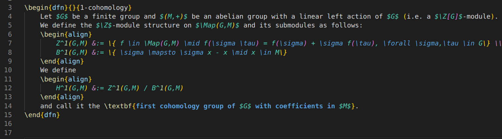
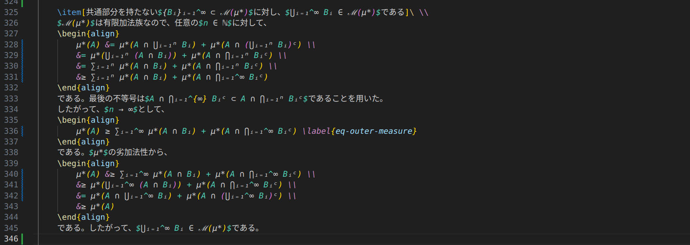

[English Version](README.md)

# ✨ LaTeX Conceal

[LaTeX Conceal](https://marketplace.visualstudio.com/items?itemName=dragoemon.latex-conceal) は、LaTeX 数式コマンドを**元のソースを変更せず**に、エディタ上で **Unicode文字**として表示します。（例: `\alpha` を `α` として表示）

## 🖼️ Example

### ⬅️ Before

### ➡️ After

数式モード内では:

- `\alpha` → `α`
- `\mathbb{R}` / `\R` → `ℝ`（置換テーブルによる）
- `_{123}` → `₁₂₃`

**ファイル内容自体は変更されず**、**表示上のデコレーションのみ**が適用されます。

## 🚀 Features

- 🔒 **数式環境限定の置換**: LaTeX コマンドの置換は、数式環境（インライン / ブロック）内でのみ適用されます。
- 👀 **Smart Reveal**: カーソル周辺では元のソースを表示し、編集しやすくします。
- 🧭 **Reveal Mode**: 元のソースを表示される範囲を、`token` / `environment` / `line` の中から選択できます。
- 📥 **`\newcommand` 自動読み込み**: ドキュメント内の `\newcommand` 等の定義からカスタム置換を自動読み込みします（引数なしのシンプルなコマンドのみ）。
- 🧩 **カスタム置換**: 設定から置換マッピングを追加・上書きできます。
- 🔘 **ステータスバー切り替え**: `Conceal: ON/OFF` を使って実行時に素早く有効/無効を切り替えられます。

## 🧮 対応する数式環境

以下の環境内で conceal が適用されます:

- `$...$`
- `$$...$$`
- `\(...\)`
- `\[...\]`
- `\begin{equation}` ... `\end{equation}`
- `align`, `alignat`, `flalign`, `multline`, `gather`, `math`, `displaymath`, `tikzcd`（`*` 付き含む）

## 🛠️ コマンド

- `LaTeX Conceal: Toggle (UI only)` (`latex-conceal.toggle`)
    - 描画の有効/無効を切り替えます

## ⚙️ 拡張設定

この拡張機能は以下の設定を提供します:

- `latex-conceal.enable`（boolean, default: `true`）
	- 起動時の conceal 描画の有効/無効を切り替えます。
- `latex-conceal.targetLanguageIds`（string array, default: `['latex', 'tex', 'markdown']`）
	- conceal 描画を適用する言語 ID を指定します。
- `latex-conceal.customReplacements`（object）
	- 置換マッピングを追加または上書きします。
- `latex-conceal.revealBehavior`（`token` | `environment` | `line`, default: `environment`）
	- カーソルが conceal 対象にあるとき、どの範囲を表示するかを制御します。
- `latex-conceal.replacementColor`（string, default: `editor.foreground`）
	- 置換する文字の色を指定します。テーマカラーキー（例: `editor.foreground`）または CSS カラー文字列（例: `#c678dd`）を指定できます。
- `latex-conceal.loadReplacementsAutomatically`（boolean, default: `true`）
	- ドキュメント（例: `\newcommand` 定義）からカスタム置換を自動読み込みします。`settings.json` の設定より優先度は低く、引数付きコマンドはサポートしません。

## ⚠️ 既知の問題

- **ネストした数式環境は正しく扱えない場合があります**（例: `$ ... \text{ $ ... $ } ... $`）。
- conceal されたグリフ（例: `α`）の右側をクリックしても、元ソーストークン（例: `\alpha`）の左側にカーソルが置かれることがあります。これは vscode api上の制限です。

## 🙏 クレジット

- デフォルトの LaTeX→Unicode 変換データは [unicodeit](https://github.com/svenkreiss/unicodeit)（MIT License）に基づいています。
- Vim の conceal 機能および類似拡張に着想を得ています。

## 📄 ライセンス

MIT。詳細は [LICENSE](LICENSE) を参照してください。
