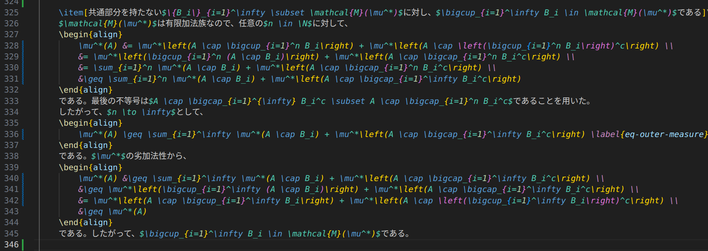

# LaTeX Conceal

LaTeX Conceal replaces common LaTeX math commands with Unicode glyphs directly in the editor while keeping your original source unchanged. (e.g., `\alpha` is displayed as `α`)

## Example

### Before

### After

In math mode:

- `\alpha` → `α`
- `\mathbb{R}` / `\R` → `ℝ` (depending on replacement table)
- `_{123}` → `₁₂₃`

Your file content is not modified; this is visual decoration only.

## Features

- Conceals LaTeX commands only inside math environments (inline and block).
- Reveals source text around the cursor for easier editing.
- Supports multiple reveal modes: `token`, `environment`, and `line`.
- Supports custom replacements via settings.
- Provides a status bar toggle (`Conceal: ON/OFF`) for quick runtime enable/disable.

## Supported Math Environments

Conceal is applied inside:

- `$...$`
- `$$...$$`
- `\(...\)`
- `\[...\]`
- `\begin{equation}` ... `\end{equation}`
- `align`, `alignat`, `flalign`, `multline`, `gather`, `math`, `displaymath`, `tikzcd` (including `*` variants)

## Commands

- `LaTeX Conceal: Toggle (UI only)` (`latex-conceal.toggle`)

## Extension Settings

This extension contributes the following settings:

- `latex-conceal.enable` (boolean, default: `true`)
	- Enables or disables conceal rendering.
- `latex-conceal.targetLanguageIds` (string array, default: `['latex', 'tex', 'markdown']`)
	- Language IDs where conceal rendering is applied 
- `latex-conceal.customReplacements` (object)
	- Adds or overrides replacement mappings.
- `latex-conceal.revealBehavior` (`token` | `environment` | `line`, default: `environment`)
	- Controls how much text is revealed when the cursor is inside concealed content.

## Known Issues

- Nested math environments are not handled correctly (e.g., `$ ... \text{ $ ... $ } ... $`).
- Clicking the right side of a concealed glyph (e.g., `α`) may still place the caret on the left side of the original source token (e.g., `\alpha`). This is a limitation of decoration-based rendering.

## Credits

- The default LaTeX-to-Unicode mapping data is based on [unicodeit](https://github.com/svenkreiss/unicodeit) (MIT License).
- Inspired by Vim's conceal feature and similar extensions.